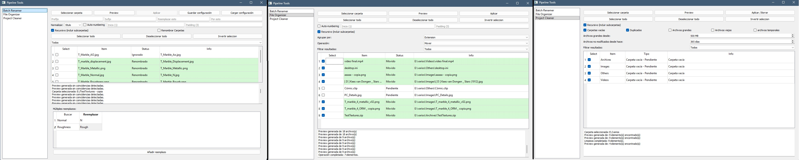

# PipelineTools

Suite of tools designed to automate and streamline common tasks within a production pipeline and file‑organization workflows.
The project is developed in Python and uses PyQt5 for the graphical user interface.


## Features
The project currently includes three tools focused on file management and organization:

- **Batch Renamer**
  - Bulk file renaming
  - Preview before applying changes.
  - Individual selection of items.
  - Select all, deselect all, and invert selection.
  - Prefixes and suffixes.
  - Text replacements.
  - Multiple replacements.
  - Upper/lowercase normalization.
  - Auto-numbering.
  - Collision detection.
  - Recursive renaming.
  - Folder renaming.
  - Saving and loading configurations. 

- **File Organizer**
  - File organization by different criteria (Extension, Alphabetically, Date (Year-Month)).
  - Preview of operations.
  - Selection of operations before executing them.
  - Option to move or copy the selected items.

- **File Cleaner**
  - Detection of files that can be deleted based on criteria (Empty folders, duplicates, temporary files, old files, and large files).
  - Preview before deleting.
  - Selection of items.
  - Controlled application of operations.
 
[](images/demo.jpg)

---

## Usage
```
  python launcher.py
```

This opens a single window with a side panel to switch between tools. The tools follow a common flow:

**Select Folder → Preview → Review and Select → Apply**

The application does not modify files directly when generating a preview. 
First, a plan of operations is generated that the user can review and select which elements to process, before finally applying the changes.
This approach aims to reduce errors and make file operations safer and more predictable.


## Technologies

- Python 3
- PyQt5

## Project structure

```text
PipelineTools/
│
├── CORE/             →  enerates and executes the operation plans
│   ├── BatchRenamer/
│   │   └── batch_renamer_core.py
│   │
│   ├── Cleaner/
│   │   └── cleaner_core.py
│   │
│   └── Organizer/
│       └── organizer_core.py
│
├── UI/                → user interaction (PyQt5)
│   ├── base_tool.py
│   ├── batch_renamer_ui.py
│   ├── cleaner_ui.py
│   └── organizer_ui.py
│
├── requirements.txt
├── README.md
└── launcher.py
```

Adding a new tool doesn't require touching **'launcher.py'** beyond registering it in *TOOL_REGISTRY*: you only need a module in *CORE/<Tool_Name>/*
with the pure logic and a class in *UI/* that inherits from **'BaseTool.py'**.

---

## Project status

The project is currently under development.
The tools are being built progressively while maintaining a common structure both in interface and logic.

---

## License
This project is under the MIT license - see [LICENSE](LICENSE).
